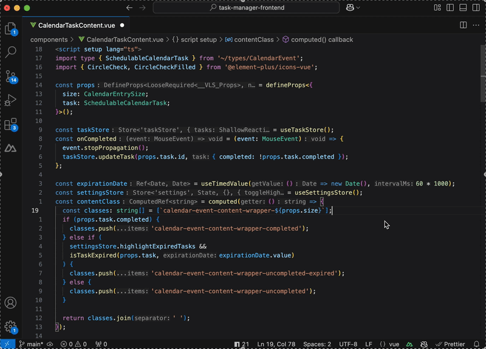

# 🔍 Nuxt Navigator

**Jump to the real source — not the generated stubs.**

This extension was created to address the issue where the Vue/TypeScript language server does not provide proper reference inference for auto-imported modules in **Nuxt 3** projects.

Instead of dropping you into `.nuxt/imports.d.ts`, this helper plugin makes sure **Go to Definition** and **Find References** take you to the *actual* source file.

---

## 📸 Demo

### Go to Definition
Clicking on an auto-imported composable like `useSettingsStore` now takes you directly to its source implementation:



---

### Peek References
Instead of pointing to Nuxt’s generated types, **Peek References** shows the true usage sites in your code:


---

## ⚡️ Features

This extension adds three commands:

### `nuxt-navigator.open-references-view` (Nuxt Navigator: Find References)
Finds and resolves references for auto-imported type definitions and merges them with the default references from the language server.  
➡️  References to type definitions in `.nuxt` will not be displayed.

---

### `nuxt-navigator.peek-references` (Nuxt Navigator: Peek References)
Displays references in an inline view, similar to the built-in "Find References".

---

### `nuxt-navigator.go-to-definition` (Nuxt Navigator: Go To Definition)
Enhances the default "Go to Definition" by resolving references that point to type definitions in `.nuxt` and navigating to the actual source file.  
➡️  Always follows the first definition if more than one are available.

---

## 🎹 Keybindings

By default, the commands are available via the Command Palette.  
You can also assign your own shortcuts in `keybindings.json`:

```jsonc
[
  {
    "command": "nuxt-navigator.open-references-view",
    "when": "editorTextFocus && nuxt-navigator.enabled"
  },
  {
    "command": "nuxt-navigator.peek-references",
    "when": "editorTextFocus && nuxt-navigator.enabled"
  },
  {
    "command": "nuxt-navigator.go-to-definition",
    "when": "editorTextFocus && nuxt-navigator.enabled"
  }
]
```

➡️  This lets you trigger **Nuxt Navigator: Find References**, **Nuxt Navigator: Peek References**, and **Nuxt Navigator: Go To Definition** with custom shortcuts that fit your workflow.

---

## 🐞 Known Issues
- "Find References" may not always work for certain types because they aren’t defined in `.nuxt/types/imports.d.ts`, which prevents the language server from resolving them.

